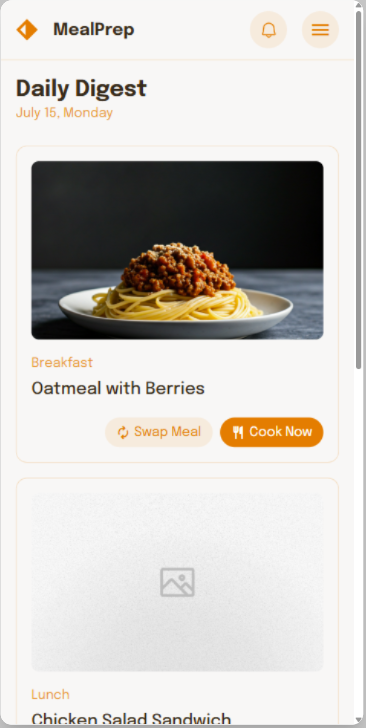
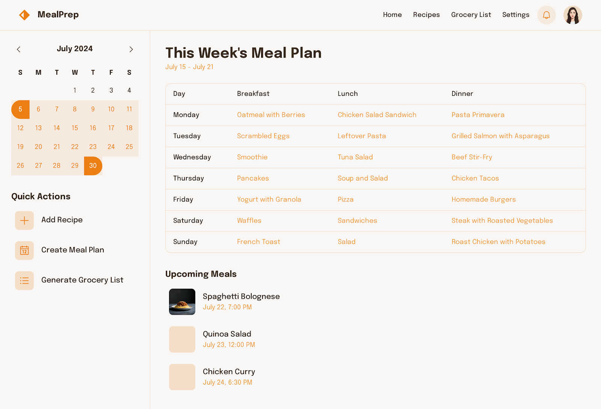

# Issue #1: Home Page

**State:** OPEN  
**Created:** 2025-10-14  
**Updated:** 2025-10-30  
**Labels:** enhancement

---

## Original Issue

Create an home page for a meal planner

todo add description, screen, acceptance criteria ...

---

## Comment 1

**Author:** Conrardy  
**Created:** 2025-10-14

### **US : Implémenter l'écran "Page d'Accueil (Home) (Mobile Version)"**

**Description**
Implémenter l'écran **Page d'Accueil (Home)** de l'application MealPlanner, qui affiche le "Daily Digest" des repas de la journée. Cet écran permet aux utilisateurs de visualiser les repas proposés pour chaque moment de la journée (petit-déjeuner, déjeuner, dîner), avec des options rapides pour échanger ou cuisiner un repas. L'écran doit être visuellement attrayant, intuitif et adapté aux besoins des utilisateurs en matière de planification alimentaire.

---

### **Exigences Visuelles**
- **En-tête de l'application** :
  - Titre "MealPrep" avec une icône de logo à gauche.
  - Barre d'en-tête fixe en haut de l'écran.
  - Fond blanc ou très clair pour l'en-tête.
  - Texte du titre en noir ou gris foncé, avec une police adaptée (ex. **Title Large**).

- **Section "Daily Digest"** :
  - Affichage de la date du jour (ex. "July 15, Monday") en orange (#FF8C00) sous le titre "Daily Digest".
  - Carte pour chaque repas de la journée (Breakfast, Lunch, Dinner) avec :
    - Une image illustrative du plat (taille adaptée à la largeur de la carte).
    - Le nom du plat (ex. "Oatmeal with Berries") en dessous de l'image.
    - Deux boutons d'action sous le nom du plat :
      - "Swap Meal" (icône d'échange + texte) en orange clair (#FFD700 ou #FF8C00).
      - "Cook Now" (icône de cuisson + texte) en orange (#FF8C00).

- **Style des cartes** :
  - Fond blanc avec bordures arrondies et une légère ombre pour un effet "carte".
  - Texte en noir ou gris foncé pour le nom du plat.
  - Espacement cohérent entre les cartes.

- **Navigation inférieure** :
  - Implémentée séparément (non visible sur cette capture, mais supposée présente).

vue mobile : 

---

### **Composants Structurels**
- **En-tête de l'application** :
  - Position fixe en haut de l'écran.
  - Titre centré.
  - Icône de notification et menu à droite.

- **Section "Daily Digest"** :
  - Conteneur plein largeur avec un titre "Daily Digest" et la date du jour.
  - Liste verticale des repas de la journée (Breakfast, Lunch, Dinner).
  - Chaque carte de repas contient :
    - Une image du plat (taille : couverture de la largeur de la carte, hauteur fixe pour uniformité).
    - Le nom du plat (ex. "Oatmeal with Berries").
    - Deux boutons d'action ("Swap Meal" et "Cook Now") alignés horizontalement.

- **Boutons d'action** :
  - Bouton "Swap Meal" :
    - Icône + texte, fond transparent, bordure orange clair (#FFD700).
    - Texte en orange (#FF8C00).
  - Bouton "Cook Now" :
    - Icône + texte, fond orange (#FF8C00), texte blanc.

- **Espacement** :
  - Marge interne (padding) cohérente dans les cartes.
  - Espacement vertical entre les cartes de 12px.

---

### **Exigences de Données**
- Liste des repas prévus pour la journée (petit-déjeuner, déjeuner, dîner).
- Images des plats proposés.
- Noms des plats.
- Identifiants uniques pour chaque repas (pour la fonctionnalité "Swap Meal").

---

### **Fonctionnalités**
- Affichage dynamique des repas en fonction de la date sélectionnée.
- Bouton "Swap Meal" : permet à l'utilisateur de remplacer le repas actuel par une autre suggestion.
- Bouton "Cook Now" : redirige vers la recette détaillée ou un minuteur de cuisson.
- Défilement vertical fluide si la liste des repas dépasse la hauteur de l'écran.
- Mise à jour en temps réel si l'utilisateur modifie un repas.

---

### **Considérations de Performance**
- Chargement optimisé des images (mise en cache, résolution adaptée).
- Temps de réponse rapide pour les actions "Swap Meal" et "Cook Now".
- Minimiser les reconstructions inutiles lors du défilement ou des interactions.

---

### **Exigences d'Accessibilité**
- Texte alternatif pour les images des plats.
- Contraste suffisant pour le texte et les boutons.
- Labels clairs pour les boutons d'action (pour les lecteurs d'écran).
- Structure sémantique pour faciliter la navigation au clavier.

---

### **Critères d'Acceptation**
- L'en-tête s'affiche avec le titre "MealPrep" et les icônes de notification/menu.
- La section "Daily Digest" affiche la date du jour et les repas prévus.
- Chaque carte de repas contient une image, le nom du plat et les deux boutons d'action.
- Les boutons "Swap Meal" et "Cook Now" sont fonctionnels et bien stylisés.
- Les images des plats sont chargées rapidement et s'affichent correctement.
- L'écran s'adapte à différentes tailles d'écran et orientations.
- Le défilement est fluide et sans saccades.
- Les interactions (clics sur les boutons) déclenchent les actions attendues.
- Gestion des cas où une image de plat est manquante (placeholder ou icône par défaut).

---

### **Cas Particuliers**
- Gestion des noms de plats très longs (troncature ou retour à la ligne).
- Affichage correct sur tous les types d'appareils (mobile, tablette).
- Comportement cohérent si l'utilisateur n'a pas encore planifié de repas pour un moment de la journée (message d'incitation à ajouter un repas).
- Gestion des erreurs si les données ne sont pas disponibles (ex. problème de connexion).

---

### **Dépendances**
- Implémentation du **Design System** (couleurs, polices, composants boutons).
- Composant personnalisé pour les cartes de repas.
- API pour récupérer les repas planifiés et les suggestions de remplacement.
- Système de navigation pour rediriger vers les écrans de recettes ou de swap.

---

## Comment 2

**Author:** Conrardy  
**Created:** 2025-10-14

### **User Story (US) : Implémenter l'écran "This Week's Meal Plan" (Version Desktop)**

---

#### **Description**
Implémenter l'écran **"This Week's Meal Plan"** pour la version desktop de l'application **MealPrep**. Cet écran permet aux utilisateurs de visualiser, organiser et gérer leurs repas pour la semaine en cours. Il affiche un calendrier interactif, un tableau des repas quotidiens (petit-déjeuner, déjeuner, dîner), et propose des actions rapides pour ajouter des recettes, créer un plan de repas ou générer une liste de courses. Une section dédiée aux "Upcoming Meals" permet également de prévisualiser les repas à venir.

---

### **Exigences Visuelles**

#### **1. En-tête et Navigation**
- **Barre de navigation supérieure** :
  - Logo **"MealPrep"** à gauche.
  - Onglets de navigation : **Home**, **Recipes**, **Grocery List**, **Settings**.
  - Icône de notification et photo de profil à droite.
  - Fond blanc ou très clair pour la barre de navigation.

#### **2. Calendrier Mensuel**
- **Affichage du mois en cours** (ex. "July 2024") :
  - Flèches de navigation (<>) pour changer de mois.
  - Jours de la semaine abrégés (**S**, **M**, **T**, **W**, **T**, **F**, **S**).
  - Numéros des jours alignés dans une grille.
  - **Jour actuel mis en évidence** avec un fond orange (#FF8C00) et un cercle blanc pour le numéro du jour.
  - Jours hors du mois en cours estompés (gris clair).

#### **3. Section "This Week's Meal Plan"**
- **Titre principal** : "This Week's Meal Plan" avec la période concernée (ex. "July 15 – July 21").
- **Tableau des repas** :
  - Colonnes : **Day**, **Breakfast**, **Lunch**, **Dinner**.
  - Lignes : Jours de la semaine (ex. Monday, Tuesday, etc.).
  - Noms des plats en orange (#FF8C00) pour chaque repas.
  - Fond blanc pour le tableau, avec des bordures légères pour séparer les lignes et colonnes.

#### **4. Section "Quick Actions"**
- Trois boutons d'action :
  - **"Add Recipe"** (icône "+").
  - **"Create Meal Plan"** (icône de calendrier).
  - **"Generate Grocery List"** (icône de liste).
  - Boutons avec fond transparent, bordure orange clair (#FFD700), texte en orange (#FF8C00).

#### **5. Section "Upcoming Meals"**
- Liste des repas à venir avec :
  - Une image miniature du plat.
  - Nom du plat et date/heure (ex. "Spaghetti Bolognese, July 22, 7:00 PM").
  - Fond légèrement coloré pour chaque carte (ex. orange très clair).

---

### **Composants Structurels**

#### **1. Calendrier Mensuel**
- Grille de 7 colonnes (jours de la semaine) et 5-6 lignes (semaines du mois).
- Interaction : cliquer sur un jour pour afficher ou modifier les repas de ce jour.

#### **2. Tableau des Repas**
- Structure en tableau avec :
  - En-têtes de colonne pour **Breakfast**, **Lunch**, **Dinner**.
  - Lignes pour chaque jour de la semaine.
  - Contenu : noms des plats pour chaque repas.

#### **3. Boutons "Quick Actions"**
- Alignés verticalement à gauche du tableau des repas.
- Chaque bouton déclenche une action spécifique :
  - **Add Recipe** : Ouvre un formulaire ou une modal pour ajouter une recette.
  - **Create Meal Plan** : Permet de générer ou modifier un plan de repas pour la semaine.
  - **Generate Grocery List** : Génère une liste de courses basée sur les repas planifiés.

#### **4. Section "Upcoming Meals"**
- Liste verticale des repas à venir.
- Chaque élément contient :
  - Une image miniature du plat.
  - Nom du plat.
  - Date et heure du repas.

---

### **Exigences de Données**
- **Données du calendrier** :
  - Mois et année en cours.
  - Jours du mois et jour actuel.
- **Données des repas** :
  - Liste des repas pour chaque jour de la semaine (petit-déjeuner, déjeuner, dîner).
  - Noms des plats et images associées.
- **Données des repas à venir** :
  - Noms des plats, dates/heures, images.

---

### **Fonctionnalités**

#### **1. Interaction avec le Calendrier**
- Navigation entre les mois via les flèches (<>).
- Sélection d'un jour pour afficher ou modifier les repas.

#### **2. Tableau des Repas**
- Affichage des repas planifiés pour chaque jour de la semaine.
- Possibilité de cliquer sur un repas pour le modifier ou voir la recette détaillée.

#### **3. Boutons "Quick Actions"**
- **"Add Recipe"** : Ouvre une interface pour ajouter une nouvelle recette au plan de repas.
- **"Create Meal Plan"** : Permet de créer ou modifier un plan de repas pour la semaine.
- **"Generate Grocery List"** : Génère une liste de courses basée sur les ingrédients des repas planifiés.

#### **4. Section "Upcoming Meals"**
- Affichage des repas à venir avec leurs détails (nom, date, heure).
- Cliquer sur un repas pour voir la recette ou le modifier.

---

### **Considérations de Performance**
- Chargement rapide des données du calendrier et des repas.
- Optimisation des images pour un affichage fluide.
- Mise à jour dynamique du tableau et des sections sans rechargement de page.

---

### **Exigences d'Accessibilité**
- Texte alternatif pour les images des plats.
- Contraste suffisant pour le texte et les boutons.
- Navigation au clavier pour toutes les fonctionnalités.
- Labels clairs pour les éléments interactifs (pour les lecteurs d'écran).

---

### **Critères d'Acceptation**
- Le calendrier mensuel s'affiche correctement avec le jour actuel mis en évidence.
- Le tableau des repas affiche les repas planifiés pour chaque jour de la semaine.
- Les boutons "Quick Actions" sont fonctionnels et déclenchent les actions attendues.
- La section "Upcoming Meals" affiche correctement les repas à venir.
- L'écran s'adapte à différentes tailles d'écran (responsive design).
- Les interactions (clics sur les jours, boutons, repas) fonctionnent sans erreur.
- Gestion des cas où des données sont manquantes (ex. repas non planifiés).

---

### **Cas Particuliers**
- Affichage correct si un jour n'a pas de repas planifiés (message d'incitation ou case vide).
- Gestion des noms de plats très longs (troncature ou retour à la ligne).
- Adaptation de la mise en page pour les écrans larges et étroits.
- Gestion des erreurs si les données ne sont pas disponibles (ex. problème de connexion).

---

### **Dépendances**
- **Design System** : Couleurs, polices, composants boutons, cartes, tableaux.
- **API** :
  - Récupération des repas planifiés.
  - Ajout/modification de recettes.
  - Génération de la liste de courses.
- **Composants réutilisables** :
  - Calendrier interactif.
  - Cartes de repas.
  - Modales pour ajouter/modifier des recettes.

---
Si tu veux ajouter ou modifier des éléments, fais-moi signe ! Je peux aussi t'aider à prioriser certaines fonctionnalités ou à détailler un composant spécifique.
