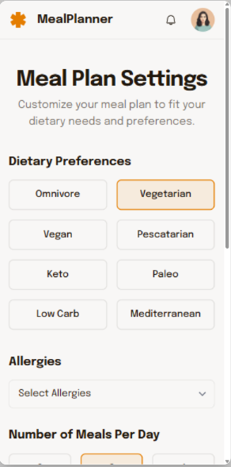
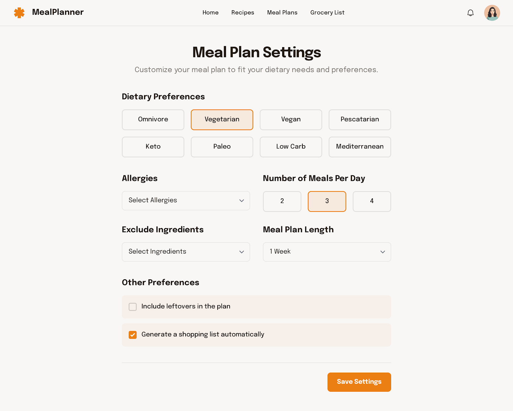

# Issue #2: Settings

**State:** OPEN  
**Created:** 2025-10-21  
**Updated:** 2025-10-30  
**Labels:** enhancement

---

## Original Issue

todo add settings US

---

## Comment 1

**Author:** Conrardy  
**Created:** 2025-10-30

### **User Story (US) : Implémenter l'écran "Meal Plan Settings" (Version Mobile)**
---
#### **Description**
Implémenter l'écran **"Meal Plan Settings"** pour la version mobile de l'application **MealPlanner**. Cet écran permet aux utilisateurs de personnaliser leurs préférences alimentaires, leurs allergies, le nombre de repas par jour, et d'autres paramètres liés à la planification des repas. L'objectif est de rendre l'expérience utilisateur intuitive et adaptée aux besoins individuels.

---
### **Exigences Visuelles**

#### **1. En-tête**
- **Barre d'en-tête** :
  - Logo **"MealPlanner"** (icône orange en forme de fourchette et de couteau).
  - Titre **"Meal Plan Settings"** en noir, police **Title Large**.
  - Sous-titre : *"Customize your meal plan to fit your dietary needs and preferences."* en gris clair.
  - Fond blanc pour l'en-tête.

#### **2. Section "Dietary Preferences"**
- **Boutons de sélection** :
  - Boutons rectangulaires avec bordures arrondies.
  - Fond gris clair pour les options non sélectionnées, fond orange (#FF8C00) pour l'option sélectionnée.
  - Texte en noir pour les options non sélectionnées, en blanc pour l'option sélectionnée.
  - Options : Omnivore, Vegetarian, Vegan, Pescatarian, Keto, Paleo, Low Carb, Mediterranean.

#### **3. Section "Allergies"**
- **Menu déroulant** :
  - Texte : *"Select Allergies"* en gris foncé.
  - Fond blanc, bordure légère en gris clair.
  - Icône de flèche vers le bas pour indiquer le menu déroulant.

#### **4. Section "Number of Meals Per Day"**
- **Boutons de sélection** :
  - Boutons rectangulaires avec bordures arrondies.
  - Fond gris clair pour les options non sélectionnées, fond orange (#FF8C00) pour l'option sélectionnée.
  - Texte en noir pour les options non sélectionnées, en blanc pour l'option sélectionnée.
  - Options : 2, 3, 4.

---
### **Composants Structurels**
#### **1. En-tête**
- Positionné en haut de l'écran.
- Logo et titre centrés horizontalement.
- Sous-titre centré sous le titre.

#### **2. Section "Dietary Preferences"**
- Grille de boutons disposés en deux lignes.
- Chaque bouton est cliquable et change de couleur lors de la sélection.

#### **3. Section "Allergies"**
- Menu déroulant positionné sous la section "Dietary Preferences".
- Largeur adaptée à la taille de l'écran.

#### **4. Section "Number of Meals Per Day"**
- Boutons alignés horizontalement.
- Positionnée sous la section "Allergies".

---
### **Exigences de Données**
- **Dietary Preferences** :
  - Liste des régimes alimentaires disponibles.
  - État de sélection pour chaque régime.
- **Allergies** :
  - Liste des allergies courantes (ex. : gluten, noix, produits laitiers).
  - Allergies sélectionnées par l'utilisateur.
- **Number of Meals Per Day** :
  - Options pour 2, 3 ou 4 repas par jour.
  - Valeur sélectionnée par l'utilisateur.

---
### **Fonctionnalités**
#### **1. Sélection des préférences alimentaires**
- L'utilisateur peut sélectionner un régime alimentaire en cliquant sur le bouton correspondant.
- Le bouton sélectionné change de couleur pour indiquer la sélection.

#### **2. Sélection des allergies**
- L'utilisateur peut ouvrir le menu déroulant et sélectionner une ou plusieurs allergies.
- Les allergies sélectionnées sont enregistrées.

#### **3. Sélection du nombre de repas par jour**
- L'utilisateur peut choisir entre 2, 3 ou 4 repas par jour.
- Le bouton sélectionné change de couleur pour indiquer la sélection.

---
### **Considérations de Performance**
- Chargement rapide des options de préférences et d'allergies.
- Réponse immédiate lors de la sélection des boutons.

---
### **Exigences d'Accessibilité**
- Texte alternatif pour les icônes.
- Contraste suffisant pour le texte et les boutons.
- Navigation au clavier pour les menus déroulants et les boutons.

---
### **Critères d'Acceptation**
- L'en-tête s'affiche avec le logo, le titre et le sous-titre.
- Les boutons de la section "Dietary Preferences" sont cliquables et changent de couleur lors de la sélection.
- Le menu déroulant "Allergies" s'ouvre et permet de sélectionner des allergies.
- Les boutons de la section "Number of Meals Per Day" sont cliquables et changent de couleur lors de la sélection.
- Les données sélectionnées sont enregistrées et affichées correctement.

---
### **Cas Particuliers**
- Gestion des cas où aucune allergie n'est sélectionnée.
- Affichage correct si l'utilisateur ne sélectionne pas de régime alimentaire.

---
### **Dépendances**
- **Design System** : Couleurs, polices, composants boutons, menus déroulants.
- **API** : Sauvegarde des préférences utilisateur.

---

### **User Story (US) : Implémenter l'écran "Meal Plan Settings" (Version Desktop)**
---
#### **Description**
Implémenter l'écran **"Meal Plan Settings"** pour la version desktop de l'application **MealPlanner**. Cet écran permet aux utilisateurs de personnaliser leurs préférences alimentaires, leurs allergies, le nombre de repas par jour, et d'autres paramètres liés à la planification des repas. Il inclut des sections supplémentaires pour exclure des ingrédients et définir la durée du plan de repas.

---
### **Exigences Visuelles**

#### **1. En-tête et Navigation**
- **Barre de navigation supérieure** :
  - Logo **"MealPlanner"** (icône orange en forme de fourchette et de couteau).
  - Onglets de navigation : **Home**, **Recipes**, **Meal Plans**, **Grocery List**.
  - Icône de notification et photo de profil à droite.
  - Fond blanc pour la barre de navigation.

#### **2. Section "Dietary Preferences"**
- **Boutons de sélection** :
  - Boutons rectangulaires avec bordures arrondies.
  - Fond gris clair pour les options non sélectionnées, fond orange (#FF8C00) pour l'option sélectionnée.
  - Texte en noir pour les options non sélectionnées, en blanc pour l'option sélectionnée.
  - Options : Omnivore, Vegetarian, Vegan, Pescatarian, Keto, Paleo, Low Carb, Mediterranean.

#### **3. Section "Allergies"**
- **Menu déroulant** :
  - Texte : *"Select Allergies"* en gris foncé.
  - Fond blanc, bordure légère en gris clair.
  - Icône de flèche vers le bas pour indiquer le menu déroulant.

#### **4. Section "Number of Meals Per Day"**
- **Boutons de sélection** :
  - Boutons rectangulaires avec bordures arrondies.
  - Fond gris clair pour les options non sélectionnées, fond orange (#FF8C00) pour l'option sélectionnée.
  - Texte en noir pour les options non sélectionnées, en blanc pour l'option sélectionnée.
  - Options : 2, 3, 4.

#### **5. Section "Exclude Ingredients"**
- **Menu déroulant** :
  - Texte : *"Select Ingredients"* en gris foncé.
  - Fond blanc, bordure légère en gris clair.
  - Icône de flèche vers le bas pour indiquer le menu déroulant.

#### **6. Section "Meal Plan Length"**
- **Menu déroulant** :
  - Texte : *"1 Week"* en gris foncé.
  - Fond blanc, bordure légère en gris clair.
  - Icône de flèche vers le bas pour indiquer le menu déroulant.

#### **7. Section "Other Preferences"**
- **Cases à cocher** :
  - Texte en noir, fond blanc.
  - Options : *"Include leftovers in the plan"*, *"Generate a shopping list automatically"*.

---
### **Composants Structurels**
#### **1. En-tête et Navigation**
- Positionné en haut de l'écran.
- Logo et onglets de navigation alignés horizontalement.

#### **2. Sections de Paramètres**
- Chaque section est clairement séparée par un titre et un espace.
- Les boutons et menus déroulants sont alignés pour une lecture facile.

---
### **Exigences de Données**
- **Dietary Preferences** : Liste des régimes alimentaires disponibles.
- **Allergies** : Liste des allergies courantes.
- **Exclude Ingredients** : Liste des ingrédients à exclure.
- **Meal Plan Length** : Options pour la durée du plan (ex. : 1 semaine, 2 semaines).
- **Other Preferences** : Options pour inclure les restes et générer une liste de courses.

---
### **Fonctionnalités**
#### **1. Sélection des préférences alimentaires**
- L'utilisateur peut sélectionner un régime alimentaire en cliquant sur le bouton correspondant.

#### **2. Sélection des allergies et des ingrédients à exclure**
- L'utilisateur peut sélectionner des allergies et des ingrédients à exclure via les menus déroulants.

#### **3. Sélection du nombre de repas par jour et de la durée du plan**
- L'utilisateur peut choisir le nombre de repas par jour et la durée du plan via les boutons et menus déroulants.

#### **4. Autres préférences**
- L'utilisateur peut cocher les cases pour inclure les restes et générer automatiquement une liste de courses.

---
### **Considérations de Performance**
- Chargement rapide des options et des menus déroulants.
- Réponse immédiate lors de la sélection des boutons et des cases à cocher.

---
### **Exigences d'Accessibilité**
- Texte alternatif pour les icônes.
- Contraste suffisant pour le texte et les boutons.
- Navigation au clavier pour les menus déroulants et les boutons.

---
### **Critères d'Acceptation**
- L'en-tête et la barre de navigation s'affichent correctement.
- Les boutons et menus déroulants sont fonctionnels et enregistrent les sélections.
- Les cases à cocher pour les autres préférences sont fonctionnelles.

---
### **Cas Particuliers**
- Gestion des cas où aucune allergie ou aucun ingrédient à exclure n'est sélectionné.
- Affichage correct si l'utilisateur ne sélectionne pas de régime alimentaire.

---
### **Dépendances**
- **Design System** : Couleurs, polices, composants boutons, menus déroulants, cases à cocher.
- **API** : Sauvegarde des préférences utilisateur.
