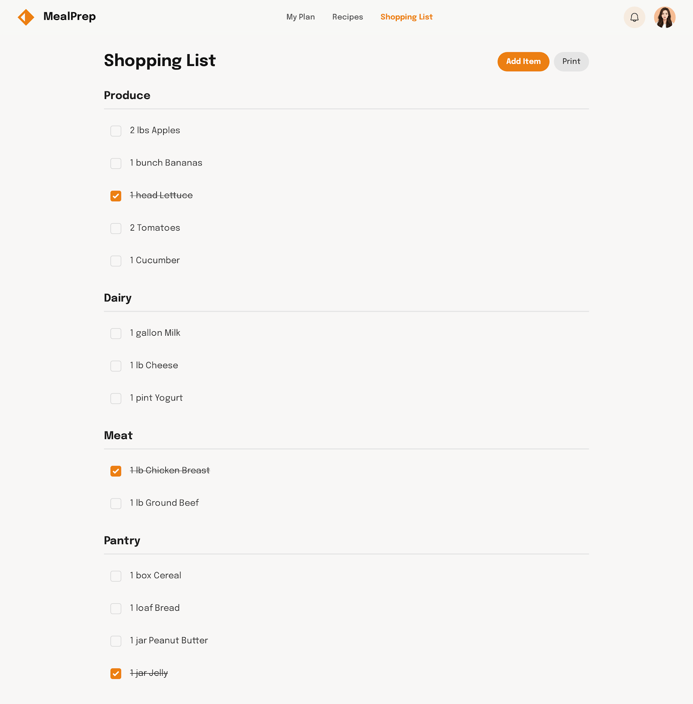
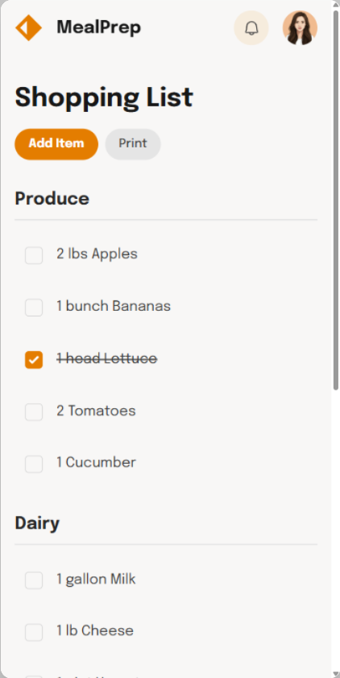

# Issue #3: Shopping List

**State:** OPEN  
**Created:** 2025-10-30  
**Updated:** 2025-10-30  
**Labels:** enhancement

---

## Description

### **US : Afficher et gérer la liste de courses (Shopping List)**
#### **Description**
Permettre à l'utilisateur de visualiser, cocher/décocher et gérer les articles de sa liste de courses, organisés par catégories (Produce, Dairy, Meat, Pantry). L'objectif est de simplifier la préparation des repas en fournissant une liste claire et interactive, synchronisée avec le plan de repas de l'utilisateur.

---

### **Exigences Visuelles**

Deskptop : 

Mobile : 

#### **1. En-tête**
- **Barre d'en-tête** :
  - Logo **"MealPrep"** (icône orange en forme de panier ou de fourchette/couteau).
  - Titre **"Shopping List"** en noir, police **Title Large**.
  - Onglets de navigation : **"My Plan"**, **"Recipes"**, **"Shopping List"** (en surbrillance orange pour indiquer la section active).
  - Icône de notification et photo de profil en haut à droite.
  - Fond blanc pour l'en-tête.

#### **2. Boutons d'action**
- **Bouton "Add Item"** :
  - Fond orange (#FF8C00), texte blanc, bordure arrondie.
  - Positionné en haut à droite sous l'en-tête.
- **Bouton "Print"** :
  - Fond gris clair, texte noir, bordure arrondie.
  - Positionné à côté du bouton "Add Item".

#### **3. Sections par catégorie**
- **Titres de section** :
  - Texte en noir, police **Subtitle Bold**, fond blanc.
  - Exemples : **"Produce"**, **"Dairy"**, **"Meat"**, **"Pantry"**.
- **Lignes de séparation** :
  - Ligne grise claire entre chaque catégorie.

#### **4. Liste des articles**
- **Articles** :
  - Texte en noir, police **Body Regular**.
  - Case à cocher à gauche de chaque article (orange quand cochée, grise sinon).
  - Quantité et nom de l'article alignés à gauche.
  - Exemple : **"✓ 1 head Lettuce"**, **"2 lbs Apples"**.

---

### **Composants Structurels**
#### **1. En-tête**
- Fixe en haut de l'écran.
- Logo et titre alignés à gauche, onglets centrés, icônes à droite.

#### **2. Boutons d'action**
- Alignés horizontalement sous l'en-tête, à droite.

#### **3. Sections par catégorie**
- Organisées verticalement dans l'ordre : **Produce**, **Dairy**, **Meat**, **Pantry**.
- Chaque section contient une liste d'articles cochables.

---

### **Exigences de Données**
- Liste des articles par catégorie, avec :
  - Nom de l'article.
  - Quantité.
  - État (coché/décoché).
- Synchronisation avec le plan de repas pour mettre à jour automatiquement la liste.

---

### **Fonctionnalités**
#### **1. Cocher/Décocher un article**
- L'utilisateur peut cocher ou décocher un article en cliquant sur la case.
- La case passe en orange quand cochée.

#### **2. Ajouter un article**
- Le bouton **"Add Item"** ouvre un champ de saisie pour ajouter un nouvel article (nom + quantité + catégorie).
- L'article est ajouté à la liste après validation.

#### **3. Imprimer la liste**
- Le bouton **"Print"** génère une version imprimable de la liste (format PDF ou impression directe).

#### **4. Synchronisation automatique**
- La liste se met à jour automatiquement en fonction des recettes sélectionnées dans **"My Plan"**.

---

### **Considérations de Performance**
- Chargement instantané de la liste.
- Mise à jour en temps réel des cases cochées/décochées.
- Optimisation pour éviter les latences lors de l'ajout ou de la suppression d'articles.

---

### **Exigences d'Accessibilité**
- Texte alternatif pour les icônes.
- Contraste suffisant entre le texte, les cases à cocher et le fond.
- Navigation au clavier pour cocher/décocher les articles et utiliser les boutons.

---

### **Critères d'Acceptation**
- L'en-tête s'affiche avec le logo, le titre et les onglets de navigation.
- Les boutons **"Add Item"** et **"Print"** sont fonctionnels et visibles.
- Les articles sont organisés par catégorie avec des cases à cocher interactives.
- Les articles cochés sont visibles en orange.
- La liste se met à jour automatiquement en fonction du plan de repas.

---
### **Cas Particuliers**
- Gestion des articles sans quantité spécifiée (ex. : "1 jar Jelly" vs "Jelly").
- Affichage d'une liste vide si aucun article n'est nécessaire pour le plan de repas actuel.
- Message de confirmation avant l'impression ou l'ajout d'un article en double.

---
### **Dépendances**
- **Design System** : Couleurs, polices, composants (boutons, cases à cocher).
- **Backend** : API pour synchroniser la liste avec le plan de repas et sauvegarder les modifications.
- **Base de données** : Stockage des articles, catégories et états (coché/décoché).

---
