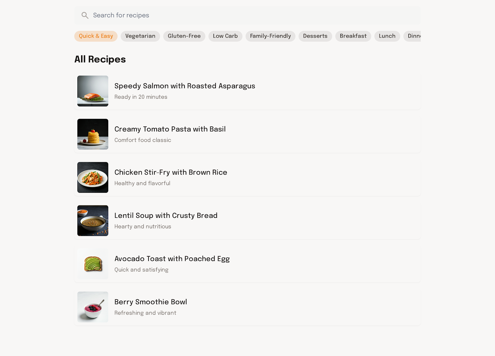
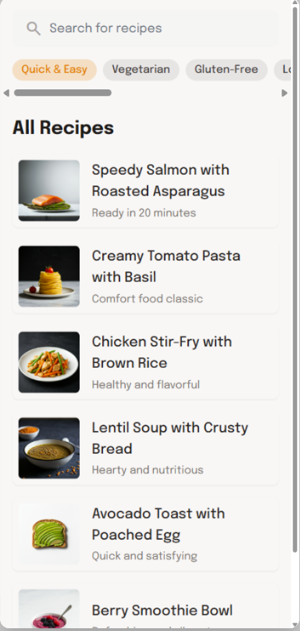

# Issue #4: Recipe discovery

**State:** OPEN  
**Created:** 2025-10-30  
**Updated:** 2025-10-30  
**Labels:** enhancement

---

## Description

### **US : Découverte et Filtrage de Recettes pour le Planificateur de Repas (Version Mobile/Desktop)**

#### **Description**
Permettre aux utilisateurs de découvrir, filtrer et parcourir une liste de recettes variées et adaptées à leurs préférences alimentaires (rapide, végétarien, sans gluten, etc.) ou à des moments spécifiques de la journée (petit-déjeuner, déjeuner, dîner). Cette fonctionnalité vise à simplifier la recherche et la sélection de repas, en offrant une expérience intuitive et personnalisable. La valeur ajoutée est d'aider les utilisateurs à trouver rapidement des idées de recettes adaptées à leurs besoins, contraintes et envies.

---

### **Exigences Visuelles**

Desktop : 

Mobile : 

#### **1. Barre de Recherche et Filtres**
- **Barre de recherche** :
  - Fond blanc, bordure légère en gris clair (#E0E0E0).
  - Icône de loupe à gauche, en gris (#757575).
  - Texte d'exemple : *"Search for recipes"* en gris clair (#9E9E9E).
- **Filtres** :
  - Boutons rectangulaires avec bordures arrondies (rayon de 20px).
  - Fond orange (#FF8C00) pour le filtre sélectionné ("Quick & Easy"), fond gris très clair (#F8F8F8) pour les autres.
  - Texte en orange (#FF8C00) pour le filtre sélectionné, en gris foncé (#424242) pour les autres.
  - Options de filtres : Quick & Easy, Vegetarian, Gluten-Free, Low Carb, Family-Friendly, Desserts, Breakfast, Lunch, Dinner.
  - Défilement horizontal pour les filtres si nécessaire.

#### **2. Liste des Recettes**
- **Titre de section** :
  - *"All Recipes"* en noir (#000000), police **Title Large**, taille 24px, gras.
- **Cartes de recettes** :
  - Fond blanc pour chaque carte, avec une bordure subtile en gris clair (#E0E0E0).
  - Image de la recette : carrée, bordure arrondie (rayon de 8px), taille fixe (80px x 80px).
  - Titre de la recette en noir (#000000), police **Subtitle Bold**, taille 16px.
  - Description en gris foncé (#616161), police **Body Regular**, taille 14px.
  - Espacement vertical de 12px entre chaque carte.

---

### **Composants Structurels**

#### **1. Barre de Recherche et Filtres**
- Positionnée en haut de l'écran, sous l'en-tête.
- Largeur : 100% de la largeur de l'écran.
- Les filtres sont alignés horizontalement et défilent si nécessaire.

#### **2. Liste des Recettes**
- Disposition en liste verticale (1 colonne pour mobile et desktop).
- Chaque carte occupe toute la largeur de l'écran, avec un padding horizontal de 16px.
- Image à gauche, titre et description à droite, alignés verticalement au centre.

---

### **Exigences de Données**
- Liste des recettes (titre, image, description, temps de préparation, tags).
- État des filtres sélectionnés par l'utilisateur.
- Résultats de recherche et de filtrage en temps réel.

---
### **Fonctionnalités**

#### **1. Recherche de Recettes**
- L'utilisateur peut saisir un terme dans la barre de recherche pour filtrer les recettes.
- Les résultats s'affichent en temps réel ou après validation.

#### **2. Filtres Personnalisables**
- L'utilisateur peut sélectionner un ou plusieurs filtres (ex. : "Vegetarian" + "Dinner").
- Les recettes affichées sont mises à jour dynamiquement en fonction des filtres appliqués.

#### **3. Affichage des Recettes**
- Chaque carte affiche : image, titre, description.
- L'utilisateur peut cliquer sur une carte pour accéder aux détails complets de la recette.

---
### **Considérations de Performance**
- Chargement rapide des images (lazy loading, mise en cache).
- Temps de réponse < 500ms pour l'application des filtres et la recherche.
- Optimisation pour les connexions mobiles et desktop.

---
### **Exigences d'Accessibilité**
- Texte alternatif pour toutes les images de recettes.
- Contraste suffisant pour le texte et les boutons (ratio minimum 4.5:1).
- Navigation au clavier pour les filtres et les cartes de recettes.
- Labels ARIA pour les éléments interactifs.

---
### **Critères d'Acceptation**
- La barre de recherche et les filtres s'affichent correctement en haut de l'écran.
- Les cartes de recettes respectent le design visuel décrit (images, titres, descriptions).
- Les filtres sont fonctionnels : la sélection d'un filtre met à jour instantanément la liste des recettes.
- L'interface est responsive et s'adapte aux tailles d'écran mobile et desktop.
- Message clair si aucune recette ne correspond aux filtres appliqués (*"No recipes found. Try adjusting your filters."*).

---
### **Cas Particuliers**
- Gestion des noms de recettes ou descriptions longues (troncature avec "..." si nécessaire).
- Affichage d'un indicateur de chargement pendant la recherche ou le filtrage.
- Gestion des erreurs de chargement des images (icône de remplacement).

---
### **Dépendances**
- **Design System** : Couleurs, polices, composants (cartes, boutons, barre de recherche).
- **API Backend** : Récupération des recettes, application des filtres et recherche.
- **Base de données** : Stockage des recettes, images et métadonnées (tags, temps de préparation, type de repas).

---
